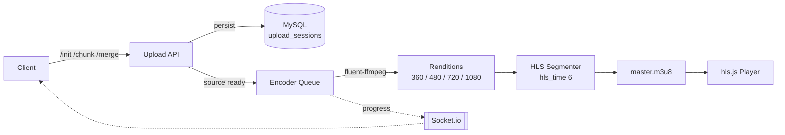

<div align="center">

<picture>
  <source media="(prefers-color-scheme: dark)" srcset="https://raw.githubusercontent.com/primer/octicons/main/icons/video-16.svg">
  
</picture>

<br><br>

<h1>StreamVault</h1>

<p><strong>Enterprise video at any scale.</strong><br>
<sub>Resumable chunk uploads. Adaptive HLS. Real-time encoding &mdash; one platform.</sub></p>

<br>

<p>
  
  
  
  
  
</p>

<p>
  <a href="#quick-start"><kbd>&nbsp;&nbsp;<b>Get started</b>&nbsp;&nbsp;</kbd></a>
  &nbsp;
  <a href="#under-the-hood"><kbd>&nbsp;&nbsp;How it works&nbsp;&nbsp;</kbd></a>
  &nbsp;
  <a href="#the-stack"><kbd>&nbsp;&nbsp;Stack&nbsp;&nbsp;</kbd></a>
  &nbsp;
  <a href="#production-deployment"><kbd>&nbsp;&nbsp;Deploy&nbsp;&nbsp;</kbd></a>
</p>

</div>

<br>

---

<br>

<div align="center">
<table><tr><td>

> <sub><b>&nbsp;&nbsp;THE THESIS&nbsp;&nbsp;</b></sub>
>
> ## &nbsp;&ldquo;A hundred-gigabyte upload should feel like a hundred-kilobyte one&mdash; <br>&nbsp;&nbsp;pause the tab, close the laptop, come back tomorrow.&rdquo;
>
> <sub>&nbsp;&nbsp;Chunked at 5&thinsp;MB. SHA-256 verified. Resumed from the exact missing index.</sub>

</td></tr></table>
</div>

<br>

## <sub>&#9679;&nbsp;&nbsp;W H A T &nbsp; I T &nbsp; D O E S</sub>

<table width="100%">
<tr>
<td width="33%" valign="top" align="center">

### &#8593;
#### UPLOAD
<sub>RESUMABLE &middot; VERIFIED</sub>

<sub>5&thinsp;MB chunks up to 100&thinsp;GB.<br>
SHA-256 per chunk. Drop-and-resume<br>
by filename+size. 48&thinsp;h session<br>
TTL via Mongo index.</sub>

</td>
<td width="33%" valign="top" align="center">

### &#9881;
#### ENCODE
<sub>H.264 &middot; 4 RENDITIONS</sub>

<sub>fluent-ffmpeg, 4 concurrent slots.<br>
360p / 480p / 720p / 1080p,<br>
capped at source. 8 auto thumbnails.<br>
Crash-resumable on boot.</sub>

</td>
<td width="33%" valign="top" align="center">

### &#9654;
#### STREAM
<sub>ADAPTIVE HLS</sub>

<sub>hls.js with native Safari fallback.<br>
6&thinsp;s segments, master playlist,<br>
quality picker, speed 0.5&ndash;2&times;,<br>
socket-pushed progress.</sub>

</td>
</tr>
</table>

<br>

## <a id="quick-start"></a><sub>&#9679;&nbsp;&nbsp;Q U I C K &nbsp; S T A R T</sub>

```bash
git clone https://github.com/you/streamvault.git && cd streamvault
npm install && npm run build            # frontend
cd server && npm install && npm run build && cd ..

cp server/.env.example server/.env      # set DB_*, JWT_SECRET, JWT_REFRESH_SECRET
mysql -u root -p -e "CREATE DATABASE streamvault"
mysql -u root -p streamvault < server/schema.sql

cd server && npm run dev                # :5000
npm run dev                             # :5173 (separate terminal, project root)
```

<sub>
Requires Node <b>&ge;&nbsp;20</b>, MySQL <b>&ge;&nbsp;8</b>, and <code>ffmpeg</code> / <code>ffprobe</code> on <code>$PATH</code>.
The <b>first registered user is auto-promoted to admin</b> — register that account before opening signup to the public.
Deploying to a real server instead of running locally? See <a href="#production-deployment">Production Deployment</a> below —
<code>deploy/setup.sh</code> automates everything above.
</sub>

<br>

## <a id="under-the-hood"></a><sub>&#9679;&nbsp;&nbsp;U N D E R &nbsp; T H E &nbsp; H O O D</sub>



A byte enters through `POST /api/upload/chunk`. It does not leave the pipeline until it is either a segmented HLS variant on disk or a `failed` record with a stack trace attached. Each stage emits a percent gate over socket.io — watchers opt into a `video:<id>` room via `watch:video`.

| Stage      | Percent  | Detail                                                                    |
| ---------- | -------- | ------------------------------------------------------------------------- |
| Probe      | 5 &ndash; 10   | FFprobe reads duration, resolution, codec.                                |
| Thumbnails | 12 &ndash; 20  | Eight timestamps sampled across the source.                               |
| Encode     | 20 &ndash; 75  | libx264 `veryfast`, CRF 23, AAC, `yuv420p`, letterbox.                    |
| Segment    | 75 &ndash; 93  | Per-quality HLS with `mpegts` and `independent_segments`.                 |
| Master     | 94       | `BANDWIDTH` + `RESOLUTION` written per variant.                           |
| Ready      | 100      | `encoding:done` emitted to `video:<id>` room.                             |

On boot, any `processing | encoding` video with an intact source file is picked back up; the rest are marked failed. Retry is one call away at `POST /api/encoding/jobs/:id/retry`.

<br>

## <sub>&#9679;&nbsp;&nbsp;A P I &nbsp; S U R F A C E</sub>

```http
POST   /api/auth/register            POST   /api/auth/login
POST   /api/auth/refresh             GET    /api/auth/me

POST   /api/upload/init              POST   /api/upload/chunk
POST   /api/upload/merge             GET    /api/upload/status/:uploadId

GET    /api/videos                   GET    /api/videos/:id
PATCH  /api/videos/:id               DELETE /api/videos/:id

POST   /api/encoding/jobs/:id/retry
POST   /api/encoding/thumbnails/:id/generate
POST   /api/encoding/thumbnails/:id/select

GET    /api/storage/stats            POST   /api/admin/cleanup
```

<br>

## <a id="the-stack"></a><sub>&#9679;&nbsp;&nbsp;T H E &nbsp; S T A C K</sub>

<table width="100%">
<tr>
<th width="50%" align="left"><sub>FRONTEND</sub></th>
<th width="50%" align="left"><sub>BACKEND</sub></th>
</tr>
<tr valign="top">
<td>

- **React + Vite** &mdash; the shell
- **hls.js `^1.6.16`** &mdash; adaptive playback
- **motion `12.23`** &mdash; page + player transitions
- **recharts** &mdash; encoding + storage analytics
- **radix-ui** &middot; **MUI 7.3** &middot; **lucide-react**
- **Tailwind-style** utility classes

</td>
<td>

- **Express `4.18`** &middot; **TypeScript `5.3`** &middot; **tsx**
- **mysql2** &mdash; plain parameterized SQL, no ORM (`server/schema.sql`)
- **socket.io `4.6`** &mdash; JWT-auth'd handshake, live channel + encoding events
- **node-media-server** &mdash; RTMP ingest for OBS live streaming
- **fluent-ffmpeg `2.1`** &middot; **multer `1.4`**
- Hardware-accelerated encoding (NVENC/QSV/AMF/VideoToolbox) with automatic
  software fallback, resource-aware VOD/live scheduling
- **jsonwebtoken 9** &middot; **bcryptjs** (cost 12)
- **helmet** &middot; **express-rate-limit** (20 / 15m auth)

</td>
</tr>
</table>

<br>

## <sub>&#9679;&nbsp;&nbsp;C O N F I G U R A T I O N</sub>

All server config lives in `server/.env`. Defaults are shipped in code; only override what you need.

| Variable                    | Default                                | Purpose                                                     |
| --------------------------- | -------------------------------------- | ----------------------------------------------------------- |
| `PORT`                      | `5000`                                 | HTTP + socket.io listener (also serves the built frontend and `/uploads` in production) |
| `CLIENT_URL`                | `http://localhost:5173`                | CORS origin for API/socket.io -- set to your real domain in production |
| `DB_HOST` / `DB_PORT` / `DB_USER` / `DB_PASSWORD` / `DB_NAME` | `localhost` / `3306` / `root` / *(empty)* / `streamvault` | MySQL connection (`mysql2` pool) |
| `JWT_SECRET` / `JWT_REFRESH_SECRET` | *required*                      | Signing secrets for access/refresh tokens                   |
| `JWT_EXPIRES_IN`            | `7d`                                   | Access token lifetime                                       |
| `JWT_REFRESH_EXPIRES_IN`    | `30d`                                  | Refresh token lifetime                                      |
| `CHUNK_SIZE_MB`             | `5`                                    | Upload chunk size negotiated at `/init`                     |
| `MAX_FILE_SIZE_GB`          | `100`                                  | Hard ceiling per upload session                             |
| `MAX_CONCURRENT_JOBS`       | `4`                                    | VOD encoder concurrency ceiling when no live broadcast is active |
| `MAX_CONCURRENT_JOBS_WHILE_LIVE` | `1`                                | VOD encoder ceiling while at least one channel is live       |
| `ENCODER_HWACCEL`           | `auto`                                 | `auto` \| `nvenc` \| `qsv` \| `amf` \| `videotoolbox` \| `software` |
| `FFMPEG_PATH` / `FFPROBE_PATH` | *auto*                              | Override if binaries are not on `$PATH`                     |
| `STORAGE_PROVIDER`          | `local`                                | Reported in `/api/storage/stats`                            |
| `STORAGE_LOCAL_PATH`        | `server/uploads`                       | Root for `temp/`, `videos/`, `thumbnails/`, `hls/`, `recordings/`, `posters/` |
| `RTMP_PORT` / `PUBLIC_RTMP_HOST` | `1935` / `localhost`              | OBS RTMP ingest port and the host streamers put in OBS's "Server" field -- **must be your public IP/domain in production, not `localhost`** |
| `LIVE_HLS_SEGMENT_TIME` / `LIVE_HLS_DVR_SECONDS` | `2` / `180`         | Live HLS segment duration and rewind window                 |

Full list with detailed comments, including every hardware-encoding and resource-scheduling knob, lives in `server/.env.example`.

<br>

## <sub>&#9679;&nbsp;&nbsp;S T O R A G E &nbsp; L A Y O U T</sub>

```
uploads/
├── temp/                    chunk staging, cleared on merge
├── videos/                  merged source masters
├── thumbnails/              8 auto + user-selected
└── hls/
    └── <videoId>/
        ├── 360p/  480p/  720p/  1080p/
        └── master.m3u8
```

<br>

## <a id="production-deployment"></a><sub>&#9679;&nbsp;&nbsp;P R O D U C T I O N &nbsp; D E P L O Y M E N T</sub>

One Node process serves the built frontend, the REST API, `/uploads`, and Socket.IO all on a single port (the frontend already only ever calls relative `/api` and connects `socket.io` to `/`, so this isn't a workaround — it's the shape the app is already built for). A reverse proxy in front of it, if you use one, only has to forward the whole domain to that one port.

```bash
git clone <your-repo-url> /var/www/streamvault && cd /var/www/streamvault
bash deploy/setup.sh
```

`deploy/setup.sh` checks for Node/ffmpeg/MySQL, installs and builds the frontend and backend, creates `server/.env` from the example file (only if one doesn't already exist), and creates the full `uploads/` directory tree. It prints the remaining manual steps at the end:

1. **Edit `server/.env`** — at minimum `DB_*`, `JWT_SECRET`/`JWT_REFRESH_SECRET`, `CLIENT_URL` (your real domain), and `PUBLIC_RTMP_HOST` (your VPS's public IP/domain, **not** `localhost`, if you'll use live streaming).
2. **Create the database and import the schema** (once): `mysql -u <user> -p streamvault < server/schema.sql`, after `CREATE DATABASE streamvault`.
3. **Install the systemd service** so the app survives crashes and reboots:
   ```bash
   sudo cp deploy/streamvault.service /etc/systemd/system/streamvault.service
   sudo systemctl daemon-reload
   sudo systemctl enable --now streamvault
   sudo journalctl -u streamvault -f   # tail logs
   ```
4. **Reverse proxy (optional)** — not sure what's already running on this VPS? `sudo ss -tlnp | grep -E ':80|:443'` tells you. If something's there, `deploy/apache-streamvault.conf` and `deploy/nginx-streamvault.conf` are ready-to-copy configs for each (WebSocket upgrade for Socket.IO, unlimited body size so chunked uploads aren't rejected before reaching Node, and a note on `mod_security` if Apache blocks large uploads by default). If nothing's listening on 80/443, this step is entirely optional — the app already works on its own port from step 3.
5. **Open port 1935** for OBS/RTMP live streaming: `sudo ufw allow 1935/tcp` (or your firewall/security group's equivalent). This port is never proxied — OBS connects to it directly.

<br>

## <sub>&#9679;&nbsp;&nbsp;R O L E S &nbsp; & &nbsp; L I M I T S</sub>

<table width="100%">
<tr><td width="20%"><sub><b>ROLES</b></sub></td><td><sub><code>admin</code> &middot; <code>editor</code> &middot; <code>viewer</code> &mdash; first registered user auto-promoted</sub></td></tr>
<tr><td><sub><b>TOKENS</b></sub></td><td><sub>JWT access <code>7d</code>, refresh <code>30d</code> (configurable)</sub></td></tr>
<tr><td><sub><b>RATE</b></sub></td><td><sub>20 auth attempts / 15 min &middot; 300 general / 15 min</sub></td></tr>
<tr><td><sub><b>UPLOAD</b></sub></td><td><sub>5&thinsp;MB chunks, 100&thinsp;GB max, 48&thinsp;h session TTL, SHA-256 optional</sub></td></tr>
<tr><td><sub><b>ENCODE</b></sub></td><td><sub>libx264 <code>veryfast</code> CRF 23, <code>+faststart</code>, HLS <code>-hls_time 6</code></sub></td></tr>
<tr><td><sub><b>STORAGE</b></sub></td><td><sub>Local filesystem &mdash; S3 / GCS behind the provider abstraction (roadmap)</sub></td></tr>
</table>

<br>

## <sub>&#9679;&nbsp;&nbsp;R O A D M A P</sub>

- S3 and GCS storage providers behind the existing provider abstraction.
- Two-factor auth wired to the `twoFactorSecret` fields already on the User model.
- Live low-latency HLS ingest and DVR window.
- Per-tenant quotas, signed playback URLs, and CDN origin shielding.

<br>

---

<div align="center">
<sub>
<b>MIT</b> &nbsp;&middot;&nbsp; Built with ffmpeg, hls.js, and a lot of chunked bytes.<br>
<code>streamvault-server</code> &nbsp;&middot;&nbsp; <code>v1.0.0</code>
</sub>
</div>
